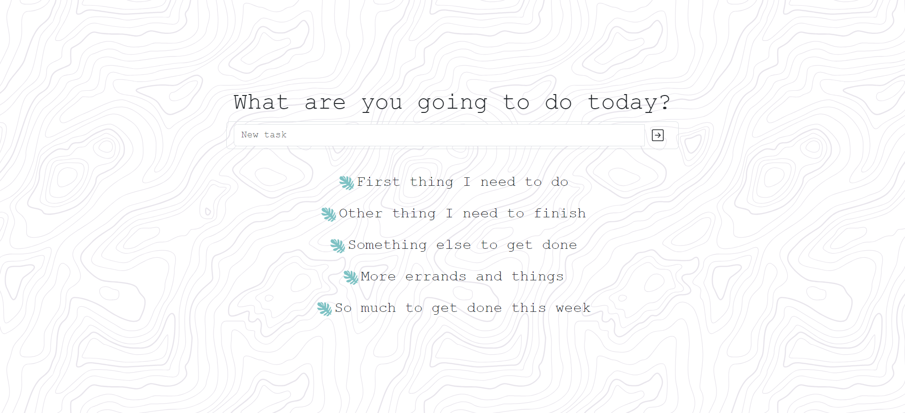

# To Do List 
To Do List is a task manager with the ability add, rename, or delete tasks.  



## Let's try! 
[To Do List](https://po1inakoroleva.github.io/to-do-list/)

## Installation
```
git clone git@github.com:po1inakoroleva/to-do-list.git
```
```
make install
```
## Running the app locally
```
make start
```
## Built with
[![React][React-badge]][React-url]
[![Redux][Redux-badge]][Redux-url]
[![Bootstrap][Bootstrap-badge]][Bootstrap-url]
[![Formik][Formik-badge]][Formik-url]

[React-badge]: https://img.shields.io/badge/React-087ea4?style=flat&logo=react&logoColor=white
[React-url]: https://react.dev

[Redux-badge]: https://img.shields.io/badge/Redux-764abc?style=flat&logo=redux
[Redux-url]: https://redux.js.org

[Bootstrap-badge]: https://img.shields.io/badge/Bootstrap-712CF9?style=flat&logo=bootstrap&logoColor=white
[Bootstrap-url]: https://getbootstrap.com


[Formik-badge]: https://img.shields.io/badge/Formik-357af3?style=flat&logo=formik
[Formik-url]: https://formik.org
